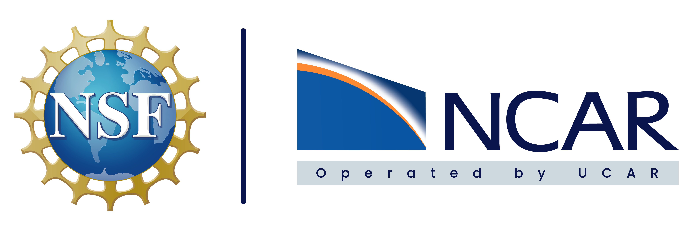

# Welcome to {{hackweek}}!

We are excited to welcome you to the Disasters, Demography, Disparities and Decisions (D4) Hack Week. This 5-day collaborative workshop hosted at the University of Washington advances research products and methods for improving observations, assessments, and forecasts across appropriate temporal and spatial scales to accomplish three goals:

-   Investigate the human behavior and societal adaptive responses to, and impacts of, severe weather and climate-related events, particularly flooding associated with atmospheric rivers, hurricanes, and severe storms, but also including other extreme events such as heat or fire.
-   Address the research gaps linking mitigation to adaptation and resilience in relation to severe weather. This will involve exploring co-benefits for human well-being from climate adaptation strategies that will further contribute to resilience to extreme weather events and climate mitigation.
-   Explore pathways to better understand the dynamics of decisions and population disparities in responses to and impacts of past extreme climate / weather events.

In order to achieve these aims, participants will create improved data products and methods that integrate social and weather and/or climate data across space and time, through interdisciplinary collaborations.

This JupyterBook contains the information you need to succeed as a participant in the D4 Hack Week.

📖 On this JupyterBook website you'll find [tutorials](tutorials/index). Some tutorials are Jupyter Notebooks, designed to be run interactively, but also rendered on this website for convenience. Others are Youtube videos or text, which you can follow along.

👩‍💻 During the D4 Hack Week, teams work collaboratively on different projects related to integrating social and meteorological data. Read more about the projects on our [teams page](teams/index)

💡 Learn more about hackweeks hosted by the [University of Washington eScience Institute](https://uwhackweek.github.io/hackweeks-as-a-service/intro.html), or check out our publication describing the hackweek educational model {cite:p}`Huppenkothen2018`.

`{admonition} Quick links for the event :class: seealso * JupyterHub: {{ jupyterhub_url }} * GitHub organization: {{ github_org_url}} * Agenda: {{ https://d4hackweek.github.io/d4book/index.html?jump_to=schedule }}`

## Hack Week Support

This workshop is supported by a partnership between the University of Washington (UW)’s [Center for Studies in Demography and Ecology (CSDE)](https://csde.washington.edu/), the [National Science Foundation AI Institute for Research on Trustworthy AI in Weather, Climate, and Coastal Oceanography (AI2ES)](https://www.ai2es.org/), and the University of Washington [eScience Institute](https://escience.washington.edu/). 

Funding for the workshop derives from a grant from NOAA to AI2ES (Award NA23OAR40505031) and a center grant to CSDE from the Eunice Kennedy Shriver National Institutes of Child Health and Human Development via the P2C HD042828 mechanism.

In his role as a *John C. Garcia Term Professor*, Dr. Shah recognizes the generous financial support made possible by Carole Garcia.

Support for the workshop organization is also provided through the Weyerhaeuser Endowed Professorship in Environmental Policy at the University of Washington Evans School of Public Policy & Governance.

 {width="176"}{width="502" height="93"}
