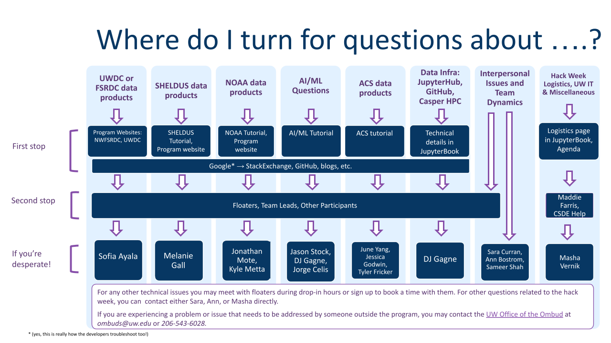

# How to Get Help

With all the moving pieces, it can be hard to know where to turn for help.
Check out this decision tree to help you figure out the best sources of information depending on your issue.

# [Floaters Sign-up Sheet](https://docs.google.com/spreadsheets/d/1Tt4WAMBPlYKBaddAqw13D6AKEP9F5x02fXkjWP9sKzA/edit?gid=0#gid=0)

# Contact Information
Sara Curran: scurran (at) uw.edu

Ann Bostrom: abostrom (at) uw.edu 

Masha Vernik: mvernik (at) uw.edu 

Sameer Shah: shs89 (at) uw.edu 

DJ Gagne: dgagne (at) ucar.edu 

Jason Stock: stock (at) rams.colostate.edu 

Maddie Farris: csde-prgm-coord (at) uw.edu 

June Yang: jyang32 (at) uw.edu 

Jessica Godwin: jlg0003 (at) uw.edu 

Tyler Fricker: tfricker (at) ulm.edu 

Melanie Gall: melanie.gall (at) asu.edu 

Sofia Ayala: sgayala (at) uw.edu 