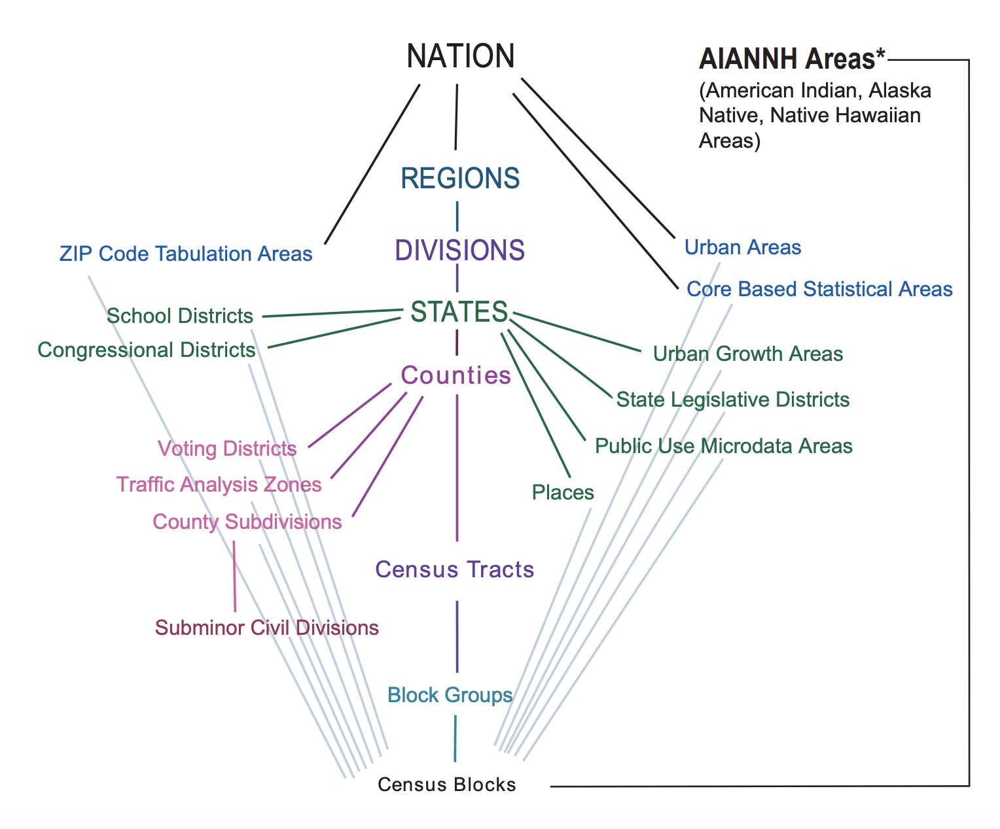
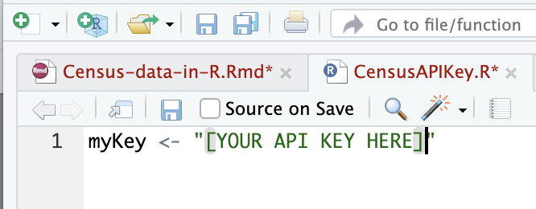
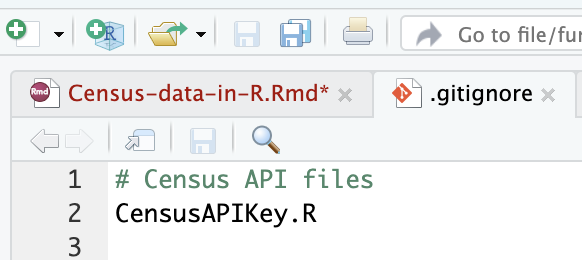

```{r setup, include=FALSE}
knitr::opts_chunk$set(echo = TRUE, warning = FALSE, message = FALSE)
knitr::opts_knit$set(root.dir =
                       dirname(rstudioapi::getActiveDocumentContext()$path))

if(FALSE){
  setwd(dirname(rstudioapi::getActiveDocumentContext()$path))
}
```

# Introduction

## Why use U.S. Census data in climate research?

U.S. Census data is one of the predominate sources for information on **population size**, particularly when disaggregated by age, sex, race/ethnicity or other demographic and economic variables. Moreover, it is one of the only datasets providing. nationally-representative demographic and economic information on **households** and **housing units**. Data is collected every 10 years via the [Decennial Census of Population and Housing](https://www.census.gov/programs-surveys/decennial-census.html), but the [American Community Surve (ACS)](https://www.census.gov/programs-surveys/acs) is an annual survey of households designed to be nationally representative that collects more in-depth information about households and their members than the decennial Census. 

It would be impossible to summarize the full array of questions asked in the ACS, but [one particularly relevant question](https://www.census.gov/acs/www/about/why-we-ask-each-question/migration/) is related to household member **migration**:

**Question 15a. Did this person live in this house or apartment 1 year ago? Possible answers:**
  
  *  Person is under 1 year old $\rightarrow$ *SKIP to question 16*
  *  Yes, this house $\rightarrow$ *SKIP to question 16*
  *  No outside the United States and Puerto Rico - *Print name of foreign country or U.S. Virgin Islands, Guam, etc. below then SKIP to question 16*
  *  No, different housein the United States or Puerto Rico.
    
**Question 15b. Where did this person live 1 year ago? Answer fields are: Address, Name of city, town, or post office, Name of U.S. county or municipio in Puerto Rico, Name of U.S. state or Puerto Rico, and ZIP Code.**

Other Census datasets include the [Population Estimates Program](https://www.census.gov/programs-surveys/popest.html) (annual post-censal population and housing units estimates for each state, county, and jurisdiction), the [Current Population Survey](https://www.census.gov/programs-surveys/cps.html) (ongoing surveys on household membership and labor force participation), and many datasets on economic indicators.

### Census geographies and uncertainty

Census data is available at a wide array of spatial resolution, and availability varies by data source. Figure 1 shows the hierarchy of Census geographies. Those geographies that can be built from the basic Census geographic unit, the Census block, like along the vertical **"geographic spine"**. Certain data products are also produced for some of the **"off-spine" geographies** in Figure 1. 



Decennial Census data is available at all geographies on the spine, but the introduction of **differential privacy** in the 2020 Decennial Census results in published counts that have more uncertainty at the smallest geographies of the spine. 2020 counts for the nation, states and large counties are reported with no uncertianty.

Aggregated, area-level ACS data is available annually at the national, state, and large county or city levels (65,000 or more). Uncertainty in these estimates arise from the **sampling variability** inherent in the household sampling scheme. Though data is collected annually, data is only shared publicly at the Census tract and block group level using 5-years of data. Sub-samples of ACS **microdata**, or person-level data, can be accessed for larger levels of geographies as well.

## Why access Census data with R or Python?

Many Census data tables are available for download as Excel files or .csv's via the Census website and through [this interactive Census website](https://data.census.gov/table). However, accessing this data is not always reproducible. Moreover, you often need to download data for bigger geographic areas than may be of interest to you. Many packages and services exist to incorporate the downloading and accessing of specific variables for specific geographies into a reproducible workflow within R or Python. In addition, these packages often do much of the necessary "heavy-lifting" required to get the data into an easy-to-use format for other data science, GIS, or statistical programming tasks.

This tutorial will provide you with the necessary tools to access the Census data you need in a reproducible and simple way. 
     
## Tutorial Outline

The rest of this tutorial is organized as follows. Section 2 introduces the Census API and R-based packages for accessing Census data. Section 3 provides an in-depth introduction to using the `tidycensus` package to query the Census API. Section 4 provides some tips on how to display or use non-spatial Census data accessed via `tidycensus`. Section 5 focuses on Census geographies and map-making using `tigris` and `tidycensus` data. Finally, Section 6 provides an important overview of how to aggregate Census tract data up to larger geographies that may be of importance to research or policy-makers but are not available in Census data.
     
#  Accessing Census Bureau Data with R Packages

##  The Census API and `censusapi`

The [Census Application Programming Interface (API)](https://www.census.gov/data/developers/guidance/api-user-guide.html) is a tool built by the Census Bureau to allow for the downloading of public use Census data in an easy and systematic way. The Census API can be queried by anyone with the internet and a **Census API Key** (a unique-to-you alphanumeric code issued by the Census Bureau).  It is constructed so you can specify the dataset and year you want, the specific variables you want within that dataset, and the geography for which you want the information within a formulaic URL in a relatively intuitive way. (See [examples](https://www.census.gov/data/developers/guidance/api-user-guide.Example_API_Queries.html#list-tab-559651575).) Though you can type these URLs into your internet browser, using functions within R or Python to visit certain URLs that query the API allow for a reproducible workflow. [This online Census Bureau course](https://www.census.gov/data/academy/courses/intro-to-the-census-bureau-data-api.html#1) is useful for those interested in learning more about the Census API

The `censusapi` package ([CRAN](https://cran.r-project.org/web/packages/censusapi/index.html), [GitHub](https://github.com/hrecht/censusapi), [Author website](https://www.hrecht.com/censusapi/)) is an R package written and maintained by [Hannah Recht](https://www.hrecht.com/) that provides a suite of functions that facilitate the construction and implementation of Census API URL queries for more than 1,500 Census API endpoints. This package is an incredible tool, but there are better options if you are mainly interested in decennial Census and ACS data.

##  IPUMS, NHGIS, and `ipumsr`

[IPUMS](https://www.ipums.org/) provides democratized census and survey data from around the world integrated across time and space. It is the world’s largest accessible database of census microdata, which includes almost a billion records from U.S. censuses from 1790 to the present and over a billion records from the international censuses of over 100 countries.

Beyond census and survey microdata, IPUMS integrates and disseminates area-level census data and electronic boundaries describing census geography for the U.S. and internationally through its [National Historical Geographic Information System (NHGIS)](https://www.nhgis.org/). NHGIS provides easy access to summary tables and time series of population, housing, agriculture, and economic data, along with GIS-compatible mapping files for all census geographies from 1790 through the present.

The `ipumsr` package ([CRAN](https://cran.r-project.org/web/packages/ipumsr/index.html), [GitHub](https://tech.popdata.org/ipumsr/)) provides an R interface for handling IPUMS data allowing for users to read files downloaded from the IPUMS extract system, request data, download files, and get metadata from certain IPUMS collectionsm, and process data using the contextual information that is included with many IPUMS files.

##  `tidycensus` and `tigris`

The `tidycensus` package ([CRAN](https://cran.r-project.org/package=tidycensus), [GitHub](https://github.com/walkerke/tidycensus), [Author website](https://walker-data.com/tidycensus/#)) is an R package written and maintained by [Kyle Walker](https://walker-data.com/). The package provides access to tabular decennial Census, ACS, ACS Migration Flows, and Population Estimates datasets at both on- and off-spine Census geographies. In addition to taking care of the logistics of querying the API for you with easy-to-use functions, the `tidycensus` package wrangles the data into a nice format, providing spatial data objects when requested. 

The `tigris` package ([CRAN](https://cran.r-project.org/web/packages/tigris/), [GitHub](https://github.com/walkerke/tigris)) is another R package written and maintained by [Kyle Walker](https://walker-data.com/). The packages allows users to directly download and use TIGER/Line shapefiles from the US Census Bureau. 

The remainder of this tutorial will focus on using `tidycensus`.


##  Getting and managing your Census API key

To use either the `censusapi` or `tidycensus` packages you need to [request your Census API key](http://api.census.gov/data/key_signup.html). This process is quick! Your own personal API key will be delivered to the email address provided.

One challenge with using these packages in a reproducible and group-based workflow is the management of API keys. Each member of the team who will be using any code that queries the Census APIs needs *their own API key*. API keys are not meant to be shared. 

One nice work around is to have everyone in a group create their own R script such as the file CensusAPIKey.R in Figure 2. This purpose will assign an individual's Census API code to a character object with a common name. In this example, everyone's API character string is assigned to an object called `myKey`.




When initializing your group's GitHub repository, add the name of this file to your `.gitignore` file as in Figure 3. **NB: It's best to do this before adding the CensusAPIKey.R to your repository.** 



Once your `.gitignore` is modified and pushed, every team member can have their own CensusAPIKey.R file on their own machine that is never pushed to GitHub. Your team's code can be written in such a way that if CensusAPIKey.R is sourced in a script, every time an API key is needed a reference to the object `myKey` will be sufficient regardless of which team member is executing code. See example using `tidycensus` below.

```{r apikey_example, echo = TRUE, eval = FALSE}
## Example works when CensusAPIKey.R is stored in
## the same filepath as the .R script being ran
## pointed to by rstudioapi::getActiveDocumentContext()$path

# Setup ####
## setwd() ####
setwd(dirname(rstudioapi::getActiveDocumentContext()$path))

## Libraries ####
library(tidycensus)

### Source Census API Key ####
source("CensusAPIKey.R")
### Set session API key in tidycensus ####
census_api_key(key = myKey)
```

# Using `tidycensus`

The `tidycensus` package is superbly developed and maintained. Moreover, Kyle Walker has developed [so much material](https://walker-data.com/tidycensus/articles/) to aid `tidycensus` users including an entire textbook, [Analyzing US Census Data: Methods, Maps, and Models in R](https://walker-data.com/census-r/index.html). For questions not answered in this tutorial, this book is a great place to start.

## Selecting variables and tables

To access Census data via `tidycensus` you need to know the following information:

  * the dataset,
  * the dataset-specific variable name,
  * the annual timeframe for which you want data,
  * the geographic level for which you want data, and
  * the temporal scale for which you want data (ACS only: 1-year or 5-year), 
  * your Census API key.
  
In the subsections below, we briefly discuss the selection process and how it relates to the `tidycensus` functions for querying Census APIs briefly. Following that, we provide full start-to-finish examples of querying both the decennial Census and ACS.

### Datasets
The dataset you use will determine the name of the `tidycensus` function used to query the Census API. 

One access decennial Census data via the `get_decennial()` function and ACS data via the `get_acs()` function.

### Variable & table names

In `tidycensus` variables can be identified in the output of the `load_variables()` function by their `name`, `label`, and `concept`. A `concept` such as `SEX BY AGE` below is shared by many variables each of which are uniquely identified by an alphanumeric string, or their `name`. Variables are also uniquely identified by the combination of their `label` and their `concept`.

In the example below, all variables in the 2021 ACS within the `SEX BY AGE` `concept` have a `name` that begins with `B01001`. These variables contain estimates and margins of error for population counts by sex (Male, Female) and age categories (0-5, 5-9, 10-14, 15-17, 18-19, 20, 21, 22-24, 25-29, 30-34, 35-39, 40-44, 45-49, 50-54, 55-59, 60-61, 62-64, 65-66, 67-69, 70-74, 75-79, 80-84, and 85+.) Totals are provided for each sex and the population overall (e.g. `B01001_001` and `B01001_002` below.) 

```{r load_var_output_pre, echo = FALSE, warning=FALSE, message=FALSE}
## Libraries ####
library(tidyr)
library(dplyr)
library(tidycensus)

### Source Census API Key ####
source("CensusAPIKey.R")
### Set session API key in tidycensus ####
census_api_key(key = myKey)
```
```{r load_var_output, echo = TRUE}
load_variables(year = 2021, dataset = "acs1") %>%
  filter(concept == "SEX BY AGE") %>% head()
```

A variable's `name` is passed as a character string to the `variables` argument of the `get_acs()` or `get_decennial()` functions, e.g. `variables = "B01001_001"`. A character vector can be passed if you would like to select more than one variable in the same API query, e.g. `variables = c("B01001_001", "B01001_002")`. 

There is also a `table` argument that allows you to select all variables from the same `concept`. For example, to select all variables from the `SEX BY AGE` concept, one would specify `table = "B01001"` and not specify anything for the `variable` argument. 

#### Tips for searching ####

If you are not sure **which** variable you want, it's helpful to save the output of the `load_variables()` function for searching and filtering concepts and labels.

There are only 6 unique concepts in the 2020 decennial census, so looking through the variables by hand is possible. 

```{r uniq_dec, message=FALSE, warning=FALSE}
dec_vars_2020 <- load_variables(year = 2020, dataset = "pl")

## Unique 2020 decennial concepts
unique(dec_vars_2020$concept)
```

However, there are 1,200 unique variable concepts in the 2021 ACS data. This cannot be easily searched through by hand.

```{r uniq_acs, message=FALSE, warning=FALSE}
acs_vars_2021 <- load_variables(year = 2021, dataset = "acs1")

## Number of unique ACS 2021 concepts
length(unique(acs_vars_2021$concept))
```

To find a variable of interest in the ACS, you could begin by using code below to scroll through some of the concepts by hand and get an idea of what types of words are used to describe variable concepts.

```{r view_acs, eval = FALSE}
acs_vars_2021 %>% 
  select(concept) %>% 
  unique() %>% View()
```

Once you know some keywords that may be a part of your concept of interest, you can use regular expression and string manipulation functions to filter down the concepts. For example, scrolling through the above output will show you that migration questions almost all contain the phrase "GEOGRAPHICAL MOBILITY".

```{r filt_acs}
acs_vars_2021 %>%
  ## Filter down to concepts containing the string
  ## "GEOGRAPHICAL MOBILITY"
  filter(grepl("GEOGRAPHICAL MOBILITY", concept)) %>% 
  select(concept) %>% 
  ## Remeber concepts cover many variables, 
  ## so we just need to see the unique values to find 
  ## the one we want
  unique()
```

If we know we are interested in breakdowns by age, we might try the following:

```{r concept_filt_2}
acs_vars_2021 %>%
  ## Filter down to concepts containing the string
  ## "GEOGRAPHICAL MOBILITY" AND "AGE"
  filter(grepl("GEOGRAPHICAL MOBILITY", concept) &
           grepl("AGE", concept)) %>% 
  select(concept) %>% 
  ## Remeber concepts cover many variables, 
  ## so we just need to see the unique values to find 
  ## the one we want
  unique()
```

Now, we have a reasonable number of concepts to choose from. The next step is to figure out what combination of strings will uniquely identify the concept you want. If we are interested in "GEOGRAPHICAL MOBILITY IN THE PAST YEAR BY AGE FOR CURRENT RESIDENCE IN PUERTO RICO" you have two options for identifying the concept and variables you want:

```{r concept_opts}
acs_vars_2021 %>% 
  ## Filter down to concepts containing the exact string
  filter(concept == "GEOGRAPHICAL MOBILITY IN THE PAST YEAR BY AGE FOR CURRENT RESIDENCE IN PUERTO RICO") %>% 
  select(concept) %>% 
  unique()

acs_vars_2021 %>% 
  ## Filter down to concepts containing the string
  ## "GEOGRAPHICAL MOBILITY" AND "BY AGE" AND "CURRENT"
  ## AND "PUERTO"
   filter(grepl("GEOGRAPHICAL MOBILITY", concept) &
           grepl("BY AGE", concept) &
            grepl("CURRENT", concept) &
            grepl("PUERTO", concept)) %>% 
  select(concept) %>% 
  unique()


```

You could store the whole vector of variable names to be used later in the `variables` argument of `get_acs()` OR store the table string to be used in the `table` argument.

```{r acs_var_store}
## Get all concept variable names
acs_vars_to_pull <- acs_vars_2021 %>% 
  ## Filter down to concepts containing the string
  ## "GEOGRAPHICAL MOBILITY" AND "BY AGE" AND "CURRENT"
  ## AND "PUERTO"
   filter(grepl("GEOGRAPHICAL MOBILITY", concept) &
           grepl("BY AGE", concept) &
            grepl("CURRENT", concept) &
            grepl("PUERTO", concept)) %>% 
  pull(name)


## Get table name
acs_vars_2021 %>% 
  ## Filter down to concepts containing the string
  ## "GEOGRAPHICAL MOBILITY" AND "BY AGE" AND "CURRENT"
  ## AND "PUERTO"
   filter(grepl("GEOGRAPHICAL MOBILITY", concept) &
           grepl("BY AGE", concept) &
            grepl("CURRENT", concept) &
            grepl("PUERTO", concept)) %>% 
  head()

acs_table_to_pull <- "B07001PR"
```

### Data Year

Both `get_acs()` and `get_decennial()` have a `year` argument. For the decennial Census and ACS 1-year data, the argument is simply the year for which you want data. However, for ACS 5-year data, the `year` argument still takes only one value and that value is the *endpoint* of the 5-year interval. For example, specifying `year = 2019` for ACS 5-year data will return estimates produced using ACS data collected in years 2015-2019.

### Geographic scale

Both `get_decennial()` and `get_acs()` require one to specify the `geography` argument indicating the geographic level (e.g. `national`, `county`, `tract`, etc.) at which data is requested. The [`tidycensus` Basic Usage vignette](https://walker-data.com/tidycensus/articles/basic-usage.html#geography-in-tidycensus) contains a list of the Census geographies and how they should be specified in `tidycensus` 
  
### Temporal scale

Once you know your dataset of interest AND your geographic scale of interest, you are ready to specify your temporal scale. 

If you are using the *decennial Census*, you will be requesting data at the single year scale regardless of your `geography`. In the `get_decennial()` function you must set your `sumfile` argument to the appropriate Census summary file for that year (2000, 2010, or 2020). Find appropriate `sumfile` arguments for each decennial Census in [Section 2.1.1.1 of Kyle Walker's book](https://walker-data.com/census-r/an-introduction-to-tidycensus.html#decennial-census).

If you are using the *ACS*, you will be requesting data at either the 1-year or 5-year scale *depending upon your choice of `geography`*. In the `get_acs()` function you must set your `survey` argument to either `acs1` for 1-year data or `acs5` for 5-year data. For national, state, and large counties or cities (Census places), you can usually specify `survey = "acs1"`. For small counties or places, tracts, or block groups you will almost certainly need to specify `survey = "acs5"`. However, even at the state or county level, there may be some variables, e.g. population counts by age, sex, and race for a race category in the Census, that have a small count in that area and will require the use of 5-year data.

## Querying the Census API
### `get_decennial()`

Below we provide code for pulling counts of total housing units for each county in the state of Washington from the 2020 decennial Census using the following information:

  * the dataset: `sumfile = pl`,
  * the dataset-specific variable name: total housing units `variables = "H1_001N"`,
  * the annual timeframe: `year = 2020`,
  * the geographic level: `geography = "county"` and `state = "WA"`,
  * the temporal scale: using decennial data, so there's no argument to specify
  * your Census API key: `key = mykey`.
  
```{r get_dec}
hu_wa_2020 <- get_decennial(geography = "county",
                            variables = "H1_001N",
                            year = 2020,
                            sumfile = "pl",
                            state = "WA",
                            key = myKey)
head(hu_wa_2020)
```

#### A note on `GEOID`s

The `GEOID` column of output includes the standard Census numeric code for a particular geography. States and counties are determined by their [Federal Information Processing Series(FIPS) codes](https://www.census.gov/library/reference/code-lists/ansi.html).

The **state** code is 2 digits long, Washington's FIPS code is 53, and we see each `GEOID` above begins with those digits.

The **county** code within each state is 3 digits long. Adams County's unique code within Washington is 001. So, the full `GEOID` for Adams County, Washington is 53001.

The **tract** code that uniquely identifies a Census tract within a county is 6 digits long. The resulting `GEOID` for a tract in Adams County, Washington is then 53001TTTTTT, where TTTTTT represents a 6-digit tract code.

The **block group** code that uniquely identifies each Census block group within a certain Census tract, TTTTTT, within Adams County, Washington is 1 digit long. The resulting `GEOID` for a block group within tract TTTTTT in Adams County, Washington is 53001TTTTTTG, where G represents a 1 digit tract code.

The **block** code that uniquely identifies each Census block within a block group, G, within a certain Census tract, TTTTTT, within Adams County, Washington is 3 digits long. The resulting `GEOID` for a block group within tract TTTTTT and block group G in Adams County, Washington is 53001TTTTTTGBBB, where BBB represents a 3 digit tract code.

### `get_acs()`
Below we provide code for pulling counts of counts of individuals by sex for King County, Washington from the 2021 ACS using the following information:

  * the dataset: ACS,
  * the dataset-specific variable name: total male (002) and female (026) population `variables = c("B01001_002", "B01001_025")`,
  * the annual timeframe: `year = 2021`,
  * the geographic level: `geography = "county"` and `state = "WA"` and `county = "King"`,
  * the temporal scale: using ACS data at county level, let's use 1-year data `survey = "acs1"`
  * your Census API key: `key = mykey`.
  
```{r get_acs_sex}
pop_sex_king_2021 <- get_acs(geography = "county",
                            variables = c("B01001_002", "B01001_026"),
                            year = 2021,
                            survey = "acs1",
                            state = "WA",
                            county = "King",
                            key = myKey)
head(pop_sex_king_2021)
```
While the output of `get_decennial()` only has a fourth column called `value` after `GEOID`, `NAME`, and `variable`, ACS output has two columns: `estimate` and `moe`.

**NB: The `moe` represents the whole margin of error for a 90\% (by default) confidence interval (CI). In other words, estimate + moe will give you the upper limit of a 90% CI and estimate - moe will give you the lower limit.**

To calculate the standard error for each estimate when the default 90\% margin of error is used, use the following code:

```{r get_acs_se}
pop_sex_king_2021 <- pop_sex_king_2021 %>% 
  mutate(se = moe/qnorm(.95))
```

Below we provide code for pulling counts of individuals by sex and age for King County, Washington from the 2021 ACS using the following information:

  * the dataset: ACS,
  * the dataset-specific variable name: all variables in the concept "SEX BY AGE" `table = "B01001"`,
  * the annual timeframe: `year = 2021`,
  * the geographic level: `geography = "county"` and `state = "WA"` and `county = "King"`,
  * the temporal scale: using ACS data at county level, let's use 1-year data `survey = "acs1"`
  * your Census API key: `key = mykey`.
  
**NB: If we wanted info for a county with a population less than 65,000 we would need to get 5-year data for 2017-2021 using `survey = "acs5"`.**
  
```{r get_acs_sex_age}
pop_sex_age_king_2021 <- get_acs(geography = "county",
                                 table = "B01001",
                                 year = 2021,
                                 survey = "acs1",
                                 state = "WA",
                                 county = "King",
                                 key = myKey)
head(pop_sex_age_king_2021)
```

## Dealing with variable labels

Now that we've walked through querying the Census API for the decennial Census and the ACS via `tidycensus` we need to cover some basics to make this data more usable. First, and foremost, no one will ever be able to remember what every alphanumeric Census variable `name` is by heart. But, if we use the output of `load_variables()` coupled with some data-wrangling, we can get neat string labels in no time!

**Step 1: Save the output of `load_variables()`**
```{r load_vars_st1}
acs_vars_2021 <- load_variables(year = 2021, dataset = "acs1")
head(acs_vars_2021)
```

**Step 2: Join `load_variables()` output with `get_*()` output**
Below, we join `acs_vars_2021` onto `pop_sex_age_king_2021` by the respective variable name column in each dataset. This still leaves the pesky issue of the "!!" and ":" in the label strings.

```{r merge_load_vars}
pop_sex_age_king_2021 <- pop_sex_age_king_2021 %>% 
  left_join(acs_vars_2021 %>% 
              select(name, label),
            by = c("variable" = "name")) %>% 
  relocate("label", .after = "variable")

head(pop_sex_age_king_2021)
```

**Step 3: Clean up the variable labels**
How you want to do this will vary for each concept, this specific example is appropriate for the "SEX BY AGE" concept. The result of this code is extra `sex` and `age` columns added to the ACS data making it easier to plot and analyze.

```{r fix_labs}
 pop_sex_age_king_2021 <- pop_sex_age_king_2021 %>% 
  ## Replace the starting "Estimate!!Total:" 
  ## with an empty string everywhere
  mutate(label = gsub("Estimate!!Total:", "", label),
  ## Replace all remaining !!
         label = gsub("!!", "", label)) %>% 
  ## The only special characters left now are the :
  ## between sex and age groups
  ## we will split the string in each row on the :
  ## and retain the first element for sex and the second for label
  group_by(variable) %>% 
  mutate(sex = unlist(strsplit(label, ":"))[1],
         age = unlist(strsplit(label, ":"))[2]) %>% 
  ungroup() %>% 
  ## Fill in "Total" strings where sex or age are missing
  mutate(sex = ifelse(is.na(sex), "Total", sex),
         age = ifelse(is.na(age), "Total", age)) %>% 
  relocate(c("sex", "age"), .after = "label")

## Check our work
pop_sex_age_king_2021 %>% 
  select(variable, label, sex, age) %>% 
  head()
```

# Getting results

## Basic tables

Suppose you simply want to report the total male and female population in King County in 2021. Our output `pop_sex_king_2021` contains all the information you need to make a nice table using the `kableExtra` package.

First, like in the last section, we want to work with the labels to get a column named "Sex" containing the words "Male" and "Female".

```{r pop_sex_tab_lab}
pop_sex_king_2021 <- pop_sex_king_2021 %>% 
  left_join(acs_vars_2021 %>% 
              select(name, label),
            by = c("variable" = "name")) %>% 
  relocate("label", .after = "variable") %>% 
  mutate(label = gsub("Estimate!!Total:", "", label),
  ## Replace all remaining !!
         label = gsub("!!", "", label),
  ## The only special characters left now are the :
  ## as there is no age group, we can simply replace these
         Sex = gsub(":", "", label)) %>% 
  relocate("Sex", .after = "label")

pop_sex_king_2021  
```


Then we can can make a nice table with 90% confidence intervals.

```{r pop_sex_tab}
library(kableExtra)

pop_sex_king_2021 %>% 
  select(Sex, estimate, moe) %>% 
  ## Calculate 90% CIs
  mutate(ci_upper = estimate + moe,
         ci_lower = estimate - moe,
         ## Make them table-pretty
         CI = paste0("(", round(ci_lower, 0), ", ",
                     round(ci_upper, 0), ")")) %>% 
  select(Sex, estimate, CI) %>% 
  kbl(digits = c(0, 0, 0),
      col.names = c("Sex", "Estimate", "90% CI"),
      row.names = FALSE, 
      caption = "ACS 1-year estimates of sex-specfic population in King County, Washington in 2021.") %>% 
  kable_styling(position = "center", full_width = FALSE)
```

## Multi-year results

One frustrating thing about `get_decennial()` and `get_acs()` is that they **do not** allow you to specify more than one year per API query. 
Below we provide a simple example of how one might pull data for several years without writing a bunch of unnecessary code or doing a lot of copy & pasting that might result in mistakes.

Suppose we want to pull the total population for King County from 2019-2022. 

Previously we saw this can be pulled for 2020 from the decennial Census using variable name "P1_001N", and for the 2021 ACS using the variable "B01001_001". **NB: While few ACS variable names have changed in recent years, it's worth checking the output of `load_variables()` for multiple years just in case. In particular, for years prior to 2010.**

We will pull data using a for loop that uses the variable `yr` to loop over year values of 2019, 2020, 2021, and 2022.

All the ACS results will have the same format with columns named `GEOID`, `name`, `variable`, `estimate`, `moe`. However, the decennial Census results have only the names `GEOID`, `name`, `variable`, `value`. We will need to do some modification of the data output from `get_decennial()` to make it compatible. Finally, we will append a `year` column to each output before combining them into a single dataset.

```{r loop}
## Set up our for loop
## empty list to store results
pop_list <- list()
## variable name strings
dec_var_to_pull <- "P1_001N"
acs_var_to_pull <- "B01001_001"
## years to loop over
years <- 2019:2022

## Loop
for(yr in years){
  if(yr == 2020){
    ## Give each list element the name "year_YYYY"
    pop_list[[paste0("year_", yr)]] <-
      get_decennial(geography = "county",
                    variables = dec_var_to_pull,
                    year = yr,
                    sumfile ="pl",
                    state = "WA",
                    county = "King") %>% 
      ## rename value to estimate
      rename("estimate" = "value") %>% 
      ## Add an moe column with values of 0 and
      ## Append a year variable column 
      ## as tidycensus does not do thisautomatically 
      mutate(moe = 0,
             year = yr)
      
  }else{
    pop_list[[paste0("year_", yr)]] <-
      get_acs(geography = "county",
              variables = acs_var_to_pull,
              year = yr,
              survey = "acs1",
              state = "WA",
              county = "King") %>% 
      ## Replace missing moes because King County has more than
      ## 65K people, and add year column
      mutate(moe = ifelse(is.na(moe), 0, moe),
             year = yr)
  }
}

## Combine each list element into a single data frame
pop_df <- do.call(rbind.data.frame, pop_list)
head(pop_df)
```


Now we can use this data to make a plot of King County's population over time.

```{r pop_plot}
library(ggplot2)

pop_df %>% 
  ggplot(aes(x = year, y = estimate)) +
  geom_point(color = "forestgreen") +
  geom_line(color = "forestgreen") +
  xlab("Year") +
  ylab("Population") +
  theme_classic()
```

##   Aggregating estimates across labels

Let us return now to our example of sex- and age-specific population. The "B01001" table from the ACS contains population estimates for each sex and age group 0-5, 5-9, 10-14, 15-17, 18-19, 20, 21, 22-24, 25-29, 30-34, 35-39, 40-44, 45-49, 50-54, 55-59, 60-61, 62-64, 65-66, 67-69, 70-74, 75-79, 80-84, and 85+. However, suppose what we want, is actualy 5-year age groups all the way up to 85+. In other words, we want to collapse 20, 21, 22-24 into 20-24, etc. We will need to aggregate both estimates and standard errors properly over age categories.

Recall our rules of expectations and variances below, where $X$ and $Y$ are two random variables and $a$ and $b$ are constants:

$$E[aX + bY] = a\times E[X] + b\times E[Y]$$
$$Var(aX + bY) = a^2 \times Var(X) + b^2 \times Var(Y) + 2ab\times Cov(X,Y).$$
When two variables $X$ and $Y$ are independent, $Cov(X,Y) = 0$, so $$Var(aX + bY) = a^2 \times Var(X) + b^2 \times Var(Y)$$.

So, if we want to aggregate over age groups 20, 21, 22-24, we might consider the real population totals to be denoted $Y_{20}$, $Y_{21}$, and $Y_{22-24}$, so that $Y_{20-24} = Y_{20} + Y_{21} + Y_{22-24}$.

$$E[Y_{20-24}] = E[Y_{20}] + E[Y_{21}] + E[Y_{22-24}].$$

To calculate the variance of $Y_{20-24}$, we need both the variances of each of $Y_{20}$, $Y_{21}$, and $Y_{22-24}$ **and** the covariances for each pair of those variables. However, the ACS only provides us with their variances. 

The best we can do to calculate $Var(Y_{20-24})$ is to assume each covariance is 0. If we assume that the population is sorted into age groups like a **multinomial** variable, the covariance between the proportion of the population in any two age categories is **always negative**. This is easy to understand intuitively if we consider the population total fixed. Then, if the proportion in one age category increases, by necessity at least one other age category's must decrease.

So, when we aggregate over age groups 20, 21, and 22-24 and calculate the variance as 
$$ Var(Y_{20-24}) = Var(Y_{20}) + Var(Y_{21}) + Var(Y_{22-24}),$$
we assume their covariances are equal to 0. While this is not an accurate estimate of the variance of $Y_{20-24}$ we expect it to be an **overestimate** as we expect the covariances $Cov(Y_{20}, Y_{21}), Cov(Y_{21}, Y_{22-24}), Cov(Y_{20}, Y_{22-24})$ to be **negative**.

Below we provide code for aggregating ACS 1-year populations by sex and age into 5-year age categories and getting the most accurate standard error we can possible. *Recall: the standard error or deviation is the square root of the variance.*

```{r agg}
## Create vector of 5 year age groups
age_groups <- c(paste0(seq(0, 80, 5), "-", seq(4, 84, 5)), "85+")
age_groups


pop_sex_age5_king_2021 <- pop_sex_age_king_2021 %>% 
  ## Turn missing moes into 0 and calculate se from moe
    mutate(moe = ifelse(is.na(moe), 0, moe),
         se = moe/qnorm(.95),
         ## make new age group
         age5 = 
           case_when(age == "Under 5 years" ~ "0-4",
                     age %in% c("15 to 17 years", "18 and 19 years") ~
                       "15-19",
                     age %in% c("20 years", "21 years", "22 to 24 years") ~
                       "20-24",
                     age %in% c("60 and 61 years", "62 to 64 years") ~
                       "60-64",
                     age %in% c("65 and 66 years", "67 to 69 years") ~
                       "60-64",
                     age == "85 years and over" ~ "85+",
                     TRUE ~ gsub(" to ", "-", age)),
         age5 = gsub(" years", "", age5),
         ## Turn it into a factor so ages will be considered in correct order
         age5 = factor(age5, levels = c("Total", age_groups))) %>% 
  ## Aggregate over age groups
  group_by(GEOID, NAME, sex, age5) %>% 
  summarize(estimate = sum(estimate), # E[X +Y] = E[X] + E[Y]
            se = sqrt(sum(se^2))) %>% #Var(X + Y) = Var(X) + Var(Y) + Cov(X,Y), SE = sqrt(Var)
  ungroup() 

## Check results
pop_sex_age_king_2021 %>% 
  filter(age %in% c("20 years", "21 years", "22 to 24 years")) %>% 
  mutate(se = moe/qnorm(.95)) %>% 
  select(sex, age, estimate, se)
pop_sex_age5_king_2021 %>% 
  filter(age5 == "20-24") %>% 
  select(sex, age5, estimate, se)
```

# Census Geographic Data

Census and ACS data are often associated with inherent *geographies*, which are units at which the data are aggregated. The defined geographies are represented in the U.S. Census Bureau's TIGER/Line database. TIGER stands for *Topologically Integrated Geographic Encoding and Referencing* and can be simply thought of as the official geographic spatial data of the U.S. Census Bureau.

Spatial data sets are made available as shapefiles and include three general types of data:

(1) Legal entities (e.g. states and counties)

(2) Statistical entities (e.g. Census tracts and block groups)

(3) Geographic features (e.g. roads and water features)

To work with Census geographic data, we suggest the use of the **tigris** package, which simplifies the process for R users of obtaining and using Census geographic data sets. 

Each type of geographic dataset available in the Census Bureau’s TIGER/Line database is available with a function in **tigris**. For example, the *states()* function can be run without arguments to download a boundary file of US states and state equivalents.

```{r}
library(tigris)
st <- states(progress_bar = FALSE)
```

**tigris** defaults to the most recent year for which a complete set of Census shapefiles are available, which---right now---is 2021.

Investigating the *st* object, we see a **sf** class representing all US states and territories, includes a data frame with a series of columns representing characteristics of those states, like a name, postal code, and Census ID (the GEOID column).

The geometry of the *st* object can be seen using the *plot()* function.
```{r}
plot(st$geometry)
```

Other Census datasets may be available by state or by county within the state. In some cases. For example, the *counties()* function can be used to obtain county boundaries for the entirety of the United States, but also can be used with the state argument to return only those counties from a specific state, like Washington.
```{r}
wa_counties <- counties("WA", progress_bar = FALSE)

plot(wa_counties$geometry)
```

States and counties are examples of legal entities that can be accessed with **tigris**. Statistical entities and geographic features are similarly accessed if they exist in the TIGER/Line database. For example, a user might request Census tract boundaries for a given county in Washington with the corresponding *tracts()* function.

```{r}
seattle_tracts <- tracts("WA", "King", progress_bar = FALSE)

plot(seattle_tracts$geometry)
```

## Plotting Geographic Data in R

R includes a number of options outside of the *plot()* function for quick visualization of geographic data that will be useful for geospatial analysis. For ease and inutitiveness, we suggest the **ggplot2** or **tmap** packages.

At a basic level, a couple lines of **ggplot2** code are all that are needed to plot Census shapes obtained with tigris. For example, taking a look at the King County Census tracts:
```{r}
ggplot(seattle_tracts) + 
  geom_sf()
```

By default, **ggplot2** includes a standard grey grid with latitude and longitude values displayed along the axes. For many cartographic applications, we would prefer to remove this background information. The *theme_minimal()* function strips the background grid, while keeping axis labels from the plot accordingly:
```{r}
ggplot(seattle_tracts) + 
  geom_sf() + 
  theme_minimal()
```

In addition to the traditional Tiger/Line shapefiles, the Census Bureau also makes available cartographic boundary shapefiles. These files are derived from the TIGER/Line shapefiles but are generalized in the interior and clipped to the shoreline of the United States, making them a better choice in many cases than the TIGER/Line shapefiles for thematic mapping. This is especially important when dealing with states that have some connection to water/international boundaries.

For our Washington counties data set, we would want to run the following code accounting for the *cb = TRUE* argument:
```{r}
wa_counties_cb <- counties("WA", cb = TRUE, progress_bar = FALSE)

plot(wa_counties$geometry)
```

Look at the difference below:
```{r}
library(patchwork)

wa_tiger_gg <- ggplot(wa_counties) + 
  geom_sf() + 
  theme_minimal() + 
  labs(title = "TIGER/Line")

wa_cb_gg <- ggplot(wa_counties_cb) + 
  geom_sf() + 
  theme_minimal() + 
  labs(title = "Cartographic boundary")

wa_tiger_gg + wa_cb_gg
```

For geographic data to appropriately represent locations in mapping and geospatial analysis, they must be referenced to some model of the Earth’s surface correctly. We define this representative model of Earth with a *coordinate reference system* (CRS), which specifies not only how data coordinates should be mapped to a model of the Earth’s surface but also how measurements should be computed using a given data set.

By default, data sets returned by **tigris** are stored in a geographic coordinate system, in which coordinates are represented as longitude and latitude relative to a three-dimensional model of the earth. The *st_crs()* function in the **sf** package helps us check the CRS of our data.

For example, let's take another look at our Washington state data. 
```{r}
library(sf)

st_crs(wa_counties)
```

All Census Bureau data sets are stored in the “NAD83” geographic coordinate system, which refers to the North American Datum of 1983. Other relevant information includes the ellipsoid used (GRS 1980, which is a generalized three-dimensional model of the Earth’s shape), the prime meridian of the CRS (Greenwich is used here), and the EPSG (European Petroleum Survey Group) ID of 4269, which is a special code that can be used to represent the CRS in more concise terms.

Thousands of projected CRSs exist in thew world. While it can be a challenge to decide on the right projected CRS for your data, the **crsuggest** package can help narrow down the choices.

For example, for the best mapping of our Washington counties data, we could choose:
```{r}
library(crsuggest)

wa_crs <- suggest_crs(wa_counties_cb)
```

The "best choice” is the CRS “NAD83(2011) / Washington North” coordinate reference system, which is available with two different variations on the NAD1983 datum. Let’s choose the second entry, “NAD83(2011) / Washington North”, which is given in meters rather than U.S. feet. Coordinate reference system transformations in **sf** are done using the *st_transform()* function.
```{r}
wa_projected <- st_transform(wa_counties_cb, crs = 6596)

st_crs(wa_projected)

plot(wa_projected$geometry)
```

With a properly projected spatial data set, now we can apply any of the geospatial analyst functions (i.e., spatial overlays, intersections, buffers, etc.) without fear of distortion. From a pure mapping perspective, geographic coordinate systems---in $^\circ$ latitude and longitude---can work, but we suggest to almost always use a properly projected coordinate reference system.

## Working with Census Geometries

While understanding coordinate reference system transformations is important for spatial data management and geographic visualization, other types of geometric manipulations may be required by the spatial analyst.

A common problem for a national display of the United States is the fragmented nature of US states and territories geographically. The continental United States can be displayed on a map in a relatively straightforward way, and there are a number of projected coordinate reference systems designed for correct display of the continental US. Often, analysts and cartographers then have to make decisions about how to handle Alaska, Hawaii, and Puerto Rico, which cannot be reasonably plotted using default US projections.

For example, let’s take a U.S. state-level shapefile obtained with **tigris** at low resolution and use **ggplot2** to visualize it in the default geographic CRS, NAD 1983:

```{r}
us_states <- states(cb = TRUE, resolution = "20m", progress_bar = FALSE)

ggplot(us_states) + 
  geom_sf() + 
  theme_minimal()
```

The plot does not work well, in part because the Aleutian Islands in far west Alaska cross the 180$^\circ$ of longitude and are plotted on the opposite side of the map. 

In response, a projected coordinate reference system appropriate for the United States could be used, such as the continental US Albers Equal Area projection:
```{r}
ggplot(us_states) + 
  geom_sf() + 
  coord_sf(crs = 'ESRI:102003') + 
  theme_minimal()
```

While this representation puts all territories in their appropriate locations, it is clearly not appropriate for Alaska, Hawaii, and Puerto Rico which appear distorted.

**tigris** offers a solution to this problem with the *shift_geometry()* function. *shift_geometry()* takes an opinionated approach to the shifting and rescaling of Alaska, Hawaii, and Puerto Rico geometries to offer four options for an alternative view of the US. The function works by projecting geometries in Alaska, Hawaii, and Puerto Rico to appropriate coordinate reference systems for those areas, then re-sizing the geometries (if requested) and moving them to an alternative layout in relationship to the rest of the US using the Albers Equal Area CRS.
```{r}
us_states_shifted <- shift_geometry(us_states)

ggplot(us_states_shifted) + 
  geom_sf() + 
  theme_minimal()
```

This view uses two default arguments: *preserve_area = FALSE*, which shrinks Alaska and inflates Hawaii and Puerto Rico, and position = "below", which places these areas below the continental United States. Alternatively, we can set *preserve_area = " "* and *position = " "* for a different view:
```{r}
us_states_outside <- shift_geometry(us_states, 
                                    preserve_area = TRUE,
                                    position = "outside")

ggplot(us_states_outside) + 
  geom_sf() + 
  theme_void()
```

## Mapping Census and ACS Estimates in R

Data from the United States Census Bureau are commonly visualized using maps, as both Census and ACS data are aggregated to enumeration units. Here, we will introduce the use of **tidycensus** and the *geometry = TRUE* argument within the *get_acs()*, *get_decennial()*, or *get_estimates()* function to investigate the spatial dimensions of Census and ACS data.

Consider 2020 ACS median household income at the Census tract level in the District of Columbia:
```{r dc_income, warning=FALSE, message=FALSE}
dc_income <- get_acs(
  geography = "tract", 
  variables = "B19013_001",
  state = "DC", 
  year = 2020,
  geometry = TRUE,
  progress_bar = TRUE
)

head(dc_income)
```

Median household income data are found in the estimate column with associated margins of error in the moe column, along with a variable ID, GEOID, and Census tract name. The geometry column contains polygon feature geometry for each Census tract.

We can map the ACS data across space using *plot()* or the functions in either the **ggplot2** or **tmap** packages. 

Because *dc_income* is a simple features object, both geometry and attributes can be visualized with *plot()*.
```{r}
plot(dc_income["estimate"])
```

The plot() function returns a simple map showing income variation in Washington, DC. Wealthier areas, as represented with warmer colors, tend to be located in the northwestern part of the District. NA values are represented on the map in white.

### Map-Making with ggplot2

**ggplot2** can be used for quick plotting of sf objects using familiar **ggplot2** syntax.

For example, let's consider the 2019 ACS 1-year estimates for median age by state:
```{r us_med_age, warning=FALSE,message=FALSE}
us_median_age <- get_acs(
  geography = "state",
  variables = "B01002_001",
  year = 2019,
  survey = "acs1",
  geometry = TRUE,
  resolution = "20m"
) %>%
  shift_geometry()

plot(us_median_age$geometry)
```

The state polygons can be styled using **ggplot2** conventions and the *geom_sf()* function. With two lines of **ggplot2** code, a basic map of median age by state can be created with **ggplot2** defaults.
```{r}
ggplot(data = us_median_age, aes(fill = estimate)) + 
  geom_sf()
```

Additional editing of the **ggplot2** syntax can alter the cartographic design of the map. For instance, we can use the color palettes provided by [RColorBrewer ](https://colorbrewer2.org/#type=sequential&scheme=PuBu&n=3) in the *scale_fill_distiller()* function. We can also alter the title, caption, and legend using the *labs()* function, and apply a *theme_minimal()* function.
```{r}
ggplot(data = us_median_age, aes(fill = estimate)) + 
  geom_sf() +
  scale_fill_distiller(palette = "PuBu") +
  labs(title = "  Median Age by State, 2019",
       caption = "Data source: 2019 1-year ACS, US Census Bureau",
       fill = "ACS estimate") +
  theme_minimal()
```

### Map-Making with tmap

Moving away from a general graphic package in **ggplot2**, the **tmap** package is an excellent alternative for mapping in R that includes a wide range of functionality for custom cartography. 

Let's consider total population by Cenus tract in King County, Washington.
```{r, message=FALSE,warning=FALSE}
v20 <- load_variables(2020, dataset = "pl")

king_pop <- get_decennial(
  geography = "tract",
  state = "WA",
  county = "King",
  variables = c(Total_Pop = "P1_001N"),
  year = 2020,
  geometry = TRUE
)

head(king_pop)
```

King County, Washington is an example of a complex Census tract geometry, given that one tract has no population (waterways surrounding Seattle). We should remove this tract before proceeding with any mapping. To do this, use the **dplyr** package and its piping (%>%) syntax.
```{r}
missing_pop <- "53033990100"

king_pop <- king_pop %>%
  filter(!GEOID %in% missing_pop)
```

tmap’s map-making syntax will be somewhat familiar to users of **ggplot2**, as it uses the concept of layers to specify modifications to the map. The map object is initialized with *tm_shape()*, which then allows us to view the Census tracts with *tm_polygons()*.
```{r}
library(tmap)

tm_shape(king_pop) +
  tm_polygons("value", palette = "PuBu")
```

**tmap** uses a classed color scheme rather than the continuous palette used by ggplot2, by default. This involves the identification of “classes” in the distribution of data values and mapping a color from a color palette to data values that belong to each class. The default classification scheme used by tm_fill() is "pretty", which identifies clean-looking intervals in the data based on the data range.

Just like with **ggplot2**, you can alter the arguments within the **tmap** package (i.e., *tm_layout()* function) to improve the map.
```{r}
tm_shape(king_pop) +
  tm_polygons("value", palette = "PuBu", title = "Total Population") +
  tm_layout(frame = FALSE,
            legend.outside = TRUE)
```

You can change the classification scheme, as well using the *style()* argument within the *tm_polygons()* function. **tmap** offers a number of classification schemes, including "cat", "fixed", "sd", "equal", "pretty", "quantile", "kmeans", "hclust", "bclust", "fisher", "jenks", "dpih", "headtails", and "log10_pretty".
```{r}
tm_shape(king_pop) +
  tm_polygons("value", palette = "PuBu", style = "quantile", title = "Total Population") +
  tm_layout(frame = FALSE,
            legend.outside = TRUE)
```

**tidycensus** offers all available Census and ACS variables included in a Census API. This makes other map types (e.g. dot-density maps) easier to navigate using functions like *as_dot_density()*. Let's try to create a dot-density map of race in King County, Washington and plot it here:
```{r, warning=FALSE, message=FALSE}
king_race <- get_decennial(
  geography = "tract",
  state = "WA",
  county = "King",
  variables = c(
    Hispanic = "P2_002N",
    White = "P2_005N",
    Black = "P2_006N",
    Native = "P2_007N",
    Asian = "P2_008N"),
  summary_var = "P2_001N",
  year = 2020,
  geometry = TRUE
) %>%
  mutate(percent = 100 * (value / summary_value))
```

Remove any zero populations/percentages
```{r}
king_race <- king_race %>%
  filter(value > 0)
```

Now back to the dot-density map of race in King County, Washington.
```{r}
king_dots <- king_race %>%
  as_dot_density(
    value = "value",
    values_per_dot = 100,
    group = "variable"
  )
```
The map itself is created with the *tm_dots()* function, which in this example is combined with a background map using *tm_polygons()* to show the relative racial and ethnic heterogeneity of Census tracts in King County.

```{r,}
background_tracts <- filter(king_race, variable == "White")

tm_shape(background_tracts) + 
  tm_polygons(col = "white", 
              border.col = "grey") + 
  tm_shape(king_dots) +
  tm_dots(col = "variable", 
          palette = "Set1",
          size = 0.005, 
          title = "1 dot = 100 people") + 
  tm_layout(frame = FALSE,
            legend.outside = TRUE)
```

# Areal Interpolation

Areal interpolation is the process making estimates from a source set of polygons to an overlapping but non-congruent set of target polygons. This technique is helpful if a project requires spatial analysis at the scale of a geometry not included in the Census enumerations.

Simply areal interpolations can be performed using functions in the **areal** package. Two function prefixes are used in areal to allow users to take advantage of R’s auto complete functionality:

(1) *ar_* - data and functions that are used for multiple interpolation methods

(2) *aw_* - functions that are used specifically for areal weighted interpolation

Let's consider a problem where HOLC Neighborhood designations are wanted to express socioeconomic and demographic data.

Read in the HOLC spatial data and plot it according to neighborhood designation. Shreveport, Louisiana HOLC designations are found [here](https://dsl.richmond.edu/panorama/redlining/data).
```{r}
ShreveportHOLC <- st_read("Data/Shreveport.json")

ShreveportHOLC <- ShreveportHOLC %>%
  filter(!grade == "NA") # remove industrial and commercial grades

pal = c("darkgreen", "blue", "yellow", "red")

#tmap_mode("view")
tm_shape(ShreveportHOLC) +
  tm_polygons(col = "grade", pal = pal, title = "HOLC Grade") + 
  tm_layout(frame = FALSE,
            legend.outside = FALSE, legend.position = c("LEFT", "bottom"))
```

Now let's grab Census tracts for Shreveport, Louisiana.
```{r, warning=FALSE, message=FALSE}
shreveport_pop <- get_decennial(
  geography = "tract",
  state = "LA",
  county = c("Caddo", "Bossier"),
  variables = c(Total_Pop = "P1_001N"),
  year = 2020,
  geometry = TRUE
)

head(shreveport_pop)

tm_shape(shreveport_pop) +
  tm_polygons("value", palette = "PuBu", style = "quantile", title = "Total Population") +
  tm_layout(frame = FALSE,
            legend.outside = TRUE)
```

To find total population in the HOLC neighborhood grades, we need to areal interpolate to the spatial dimensions of the HOLC neighborhoods. Start by adding an "ID" column to both spatial data sets for the *aw_interpolate()* function to properly work. In addition, it is important to ensure the CRS for each spatial data set is projected in the same reference system. We do this below with the *st_transform()* function.
```{r}
library(areal)
ShreveportHOLC$ID <- 1:nrow(ShreveportHOLC)
shreveport_pop$ID2 <- 1:nrow(shreveport_pop)

ShreveportHOLC <- ShreveportHOLC %>%
  st_set_crs(st_crs(shreveport_pop)) %>%
  st_transform(., 5070)

shreveport_pop <- shreveport_pop %>%
  st_transform(., 5070)

ar_validate(shreveport_pop, ShreveportHOLC, "value")

interpolated_output <- aw_interpolate(ShreveportHOLC, 
               tid = "ID", 
               source = shreveport_pop, 
               sid = "ID2",
               extensive = "value",
               weight = "total", 
               output = "sf")

interpolated_output <- interpolated_output %>%
  mutate(value = round(value))
```

Now we have a total population count ("value") for each HOLC neighborhood designation (26 polygons). 

We can then map total population by neighborhood individually:
```{r}
tm_shape(interpolated_output) +
  tm_polygons("value", palette = "PuBu", style = "quantile", title = "Total Population") +
  tm_layout(frame = FALSE,
            legend.outside = FALSE, legend.position = c("LEFT", "bottom"))
```

Or we can map total population by neighborhood grouped:
```{r}
interpolated_output_grouped <- interpolated_output %>%
  group_by(grade) %>%
  summarize(value = sum(value))

tm_shape(interpolated_output_grouped) +
  tm_polygons("value", palette = "PuBu", style = "quantile", title = "Total Population") +
  tm_layout(frame = FALSE,
            legend.outside = FALSE, legend.position = c("LEFT", "bottom"))
```

Plot with the HOLC neighborhood designations side-by-side.
```{r}
A <- tm_shape(ShreveportHOLC) +
  tm_polygons(col = "grade", pal = pal, title = "HOLC Grade") + 
  tm_style('white', main.title ="A", main.title.position = "left") +
  tm_layout(frame = FALSE,
            legend.outside = FALSE)
  
B <- tm_shape(interpolated_output_grouped) +
  tm_polygons("value", palette = "PuBu", style = "quantile", title = "Total Population") +
  tm_style('white', main.title ="B", main.title.position = "left") +
  tm_layout(frame = FALSE,
            legend.outside = FALSE, legend.position = c("LEFT", "bottom"))

tmap_arrange(A, B, ncol = 2, asp = TRUE)
```

WE NEED SOME TYPE OF ENDING HERE!


     